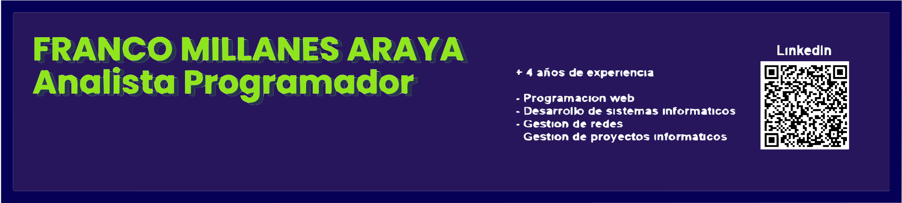

    <h1 align="center">Hola, soy <a href="https://curriculum-vitae-p4yu321xr-franko2015.vercel.app">Franco Millanes Araya</a> 👋</h1>

## Sobre mí

- 📲 Desarrollador android
- 🌐 Desarrollador web
- 🖥️ Desarrollador Front-end
- 💻 Analista programador

 

## Proyectos *bombitas*
<table>
<!-- Aquí puedes modificar la información de tus proyectos -->
<tr>
<td width="50%">
    <h3 align="center">Sistema de Soluciones Informáticas</h3>
    

        
        

            
        

        
Sistema para responder a soluciones informáticas</strong> - La instensión de este sistema es promover al usuario a la comodidad de mejorar la calidad de atención por parte de la empresa de TI, dejando este proyecto</strong> con todo el código disponible para descargar.

    
                                                               
</td>

<!-- Puedes agregar más proyectos aquí -->

</table>

 

### ⚙️ &nbsp;GitHub Analytics

    

